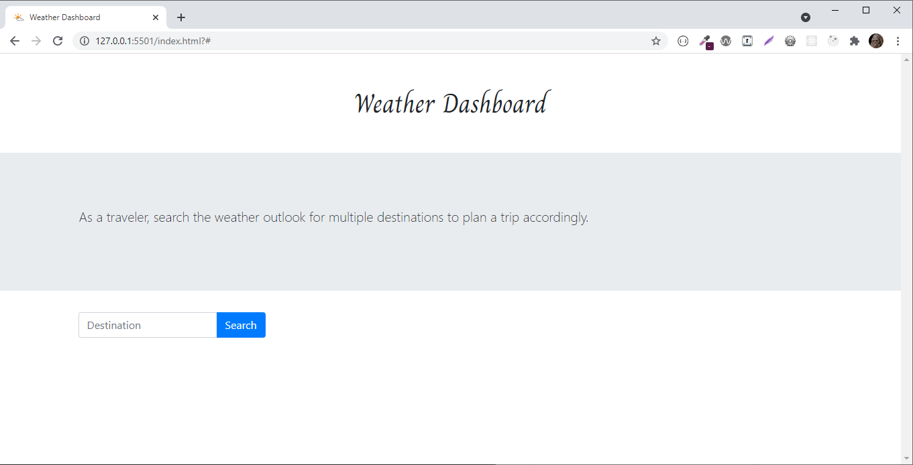
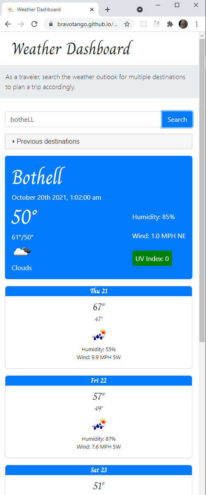

# Weather-Dashboard

This weather application allows users to search destinations for current weather and that destination's future 5-day forecast. This application stores valid search destinations allowing the user to select a previous destination to again view that destination's current and future 5-day forecast.

This application leverages BootstrapCSS, jQuery, jQuery-Ui, and Moment.js.

## User Story

```
AS A traveler
I WANT to see the weather outlook for multiple cities
SO THAT I can plan a trip accordingly
```

## Satisfied Acceptance Criteria

```
GIVEN a weather dashboard with form inputs
WHEN I search for a city
THEN I am presented with current and future conditions for that city and that city is added to the search history
WHEN I view current weather conditions for that city
THEN I am presented with the city name, the date, an icon representation of weather conditions, the temperature, the humidity, the wind speed, and the UV index
WHEN I view the UV index
THEN I am presented with a color that indicates whether the conditions are favorable, moderate, or severe
WHEN I view future weather conditions for that city
THEN I am presented with a 5-day forecast that displays the date, an icon representation of weather conditions, the temperature, the wind speed, and the humidity
WHEN I click on a city in the search history
THEN I am again presented with current and future conditions for that city
```

## Screenshots

### Desktop Initial

A simple desktop interface is presented to new desktop visitors.



### Mobile Initial

A simple mobile interface is presented to new mobile visitors.


### Desktop Search

This user interface uses screen real estate to display current and forecast weather all within the desktop view port


### Mobile Search

This user interface is responsive and displays nicely for mobile users.



### Search History

Valid search history is stored in & pulled from local storage. It is displayed in the UI within a jquery-ui collapse/accordion.

The name returned from the service is used for local storage. If users enter random casing (lowercase used in screenshot), the normalized name (with proper casing) returned from the service is stored and represented to the UI for consistency.


### Bad Request

A bad request will result in an error displayed with the error status code.


## Github Deployed Application

[https://bravotango.github.io/Weather-Dashboard/](https://bravotango.github.io/Weather-Dashboard/)
